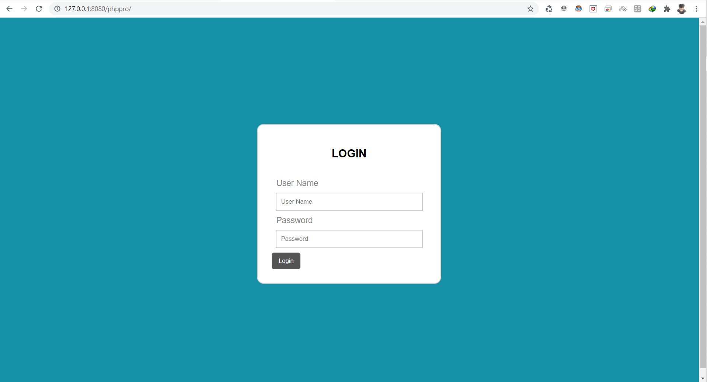
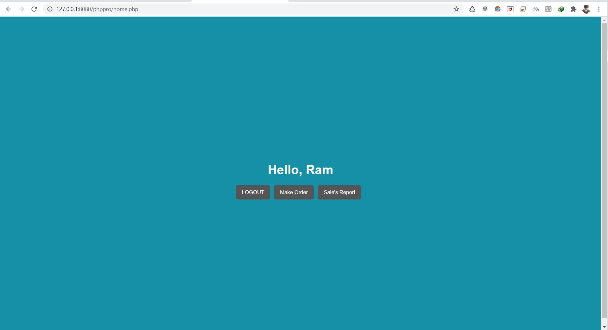
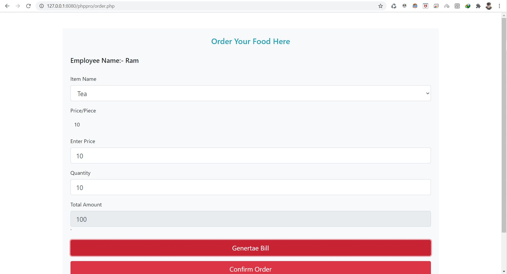
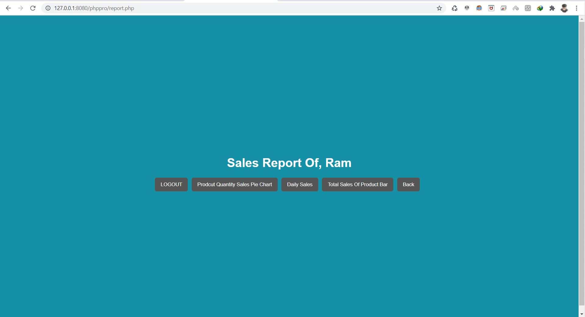
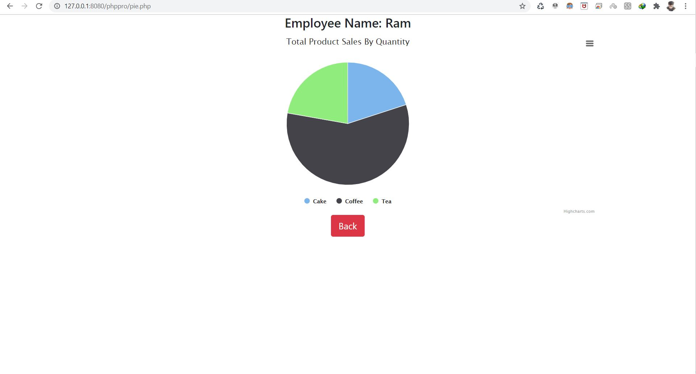

# iTalent-assignment
## Step to setup project
 1. Download or copy files from github to local machine 
 2. Create a folder inside xampp htdocs folder and copy all downloaded files in it 
 3. Import sql file name 'rest_db.sql' into phpmyadmin 
 
 ## ScreenShot Of Project:
 1. Login
  
  
 2. Home
  
 3. Order Page
  
 4. Sales Report
  
 5. Pie Chart For Quantity Wise Sale
  
 6. Daily Sales
  
 7. Prodcut Wise Sales
  
  
